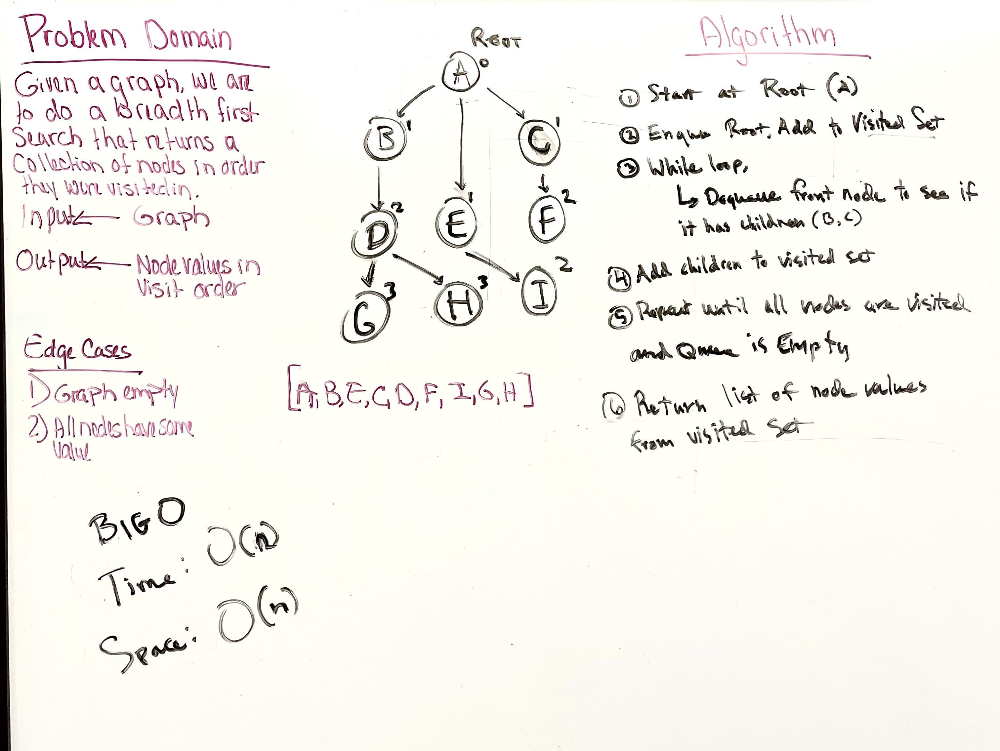

# Breadth First Graph

---

## Problem Domain

* Implement a method for a breadth-first traversal on a graph that does not take in any arguments and returns a collection of nodes in the order they were visited

---

### Input/Output

* Input: Graph

* Output: Node values in order they were visted

---

### Big O

* Time: O(n)

* Space: O(n)

---

### Whiteboard Visual

---

### Unit Tests

* Write tests for the following scenarios, and any other cases that help you ensure your code is working as expected

---

[Home](/README.md)