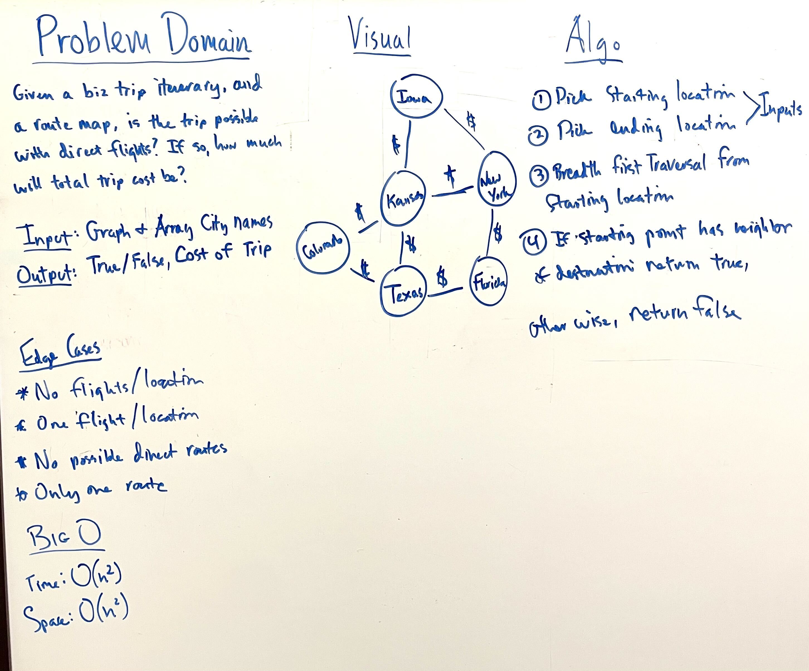

# Graph Business Trip

---

## Problem Domain

* Given a business trip itinery, and an Alaska Airlines route map, is the trip possible with direct flights? If so, how uch will the total trip cost be?

---

### Input/Output

* Input: Graph and array of City names

* Output: True/False on whether or not you can do a direct route to Cities, and a total cost if it is true.

---

### Big O

* Time: O(n^2)

* Space: O(n^2)

---

### Whiteboard Visual

---

### Unit Tests

* Write tests for the following scenarios, and any other cases that help you ensure your code is working as expected

---

[Home](/README.md)