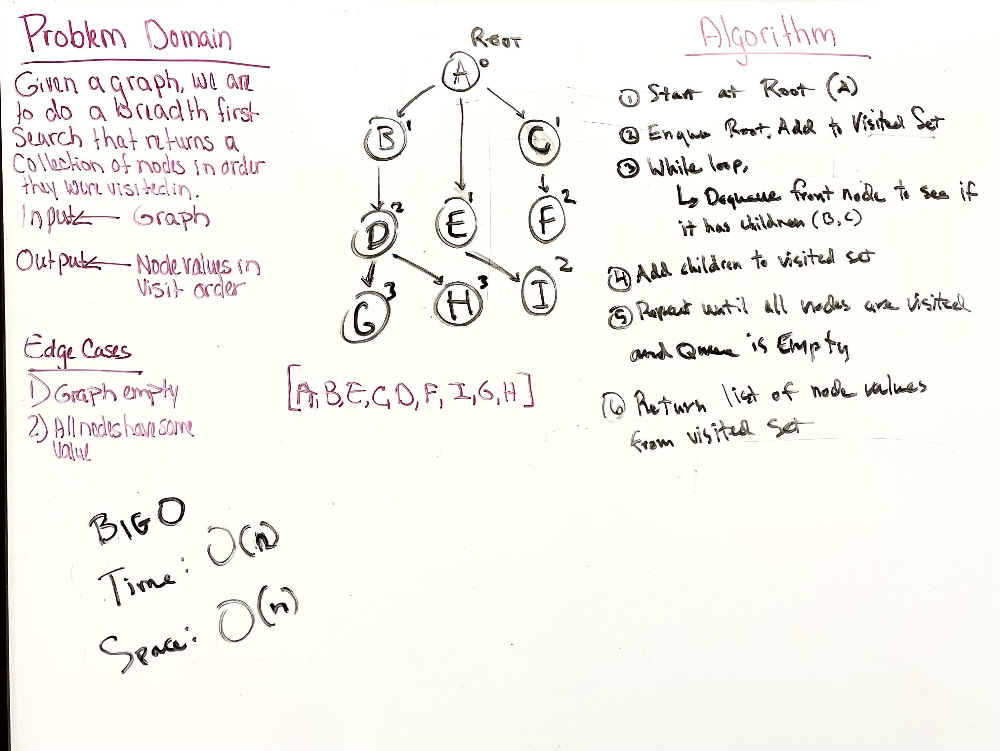

# Graph Depth First

---

## Problem Domain

* Conduct a depth first preorder traversal on a graph

* Write a method named DepthFirst()

  * Arguments: None (starting point of the serach)

  * Return: Nodes in pre-order traversal order

---

### Input/Output

* Input: Graph

* Output: A collection of nodes in their pre-order depth-first traversal order. DISPLAY THE COLLECTION

---

### Big O

* Time: O(n)

* Space: O(n)

---

### Whiteboard Visual

---

### Unit Tests

* Write tests for the following scenarios, and any other cases that help you ensure your code is working as expected

---

[Home](/README.md)