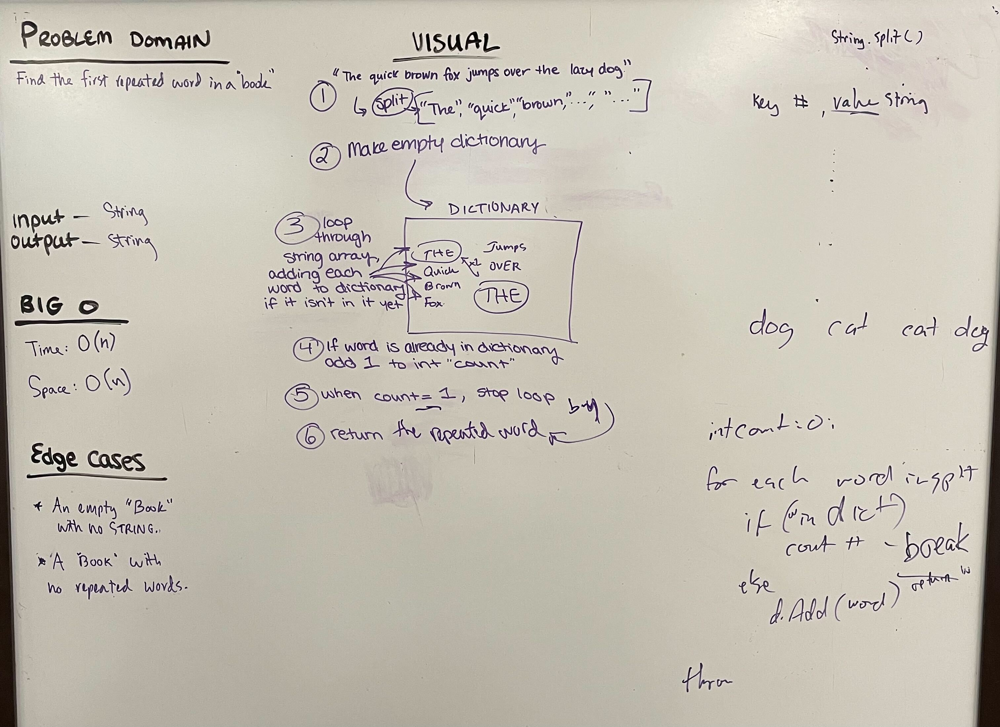

# Hashmap Repeated Word

## Book Repeated Word

* Write a function called repeated word that finds the first word to occur more than once in a string

* Arguments: string

* Return: string

---

### Problem Domain

Find the first repetead word in a "BOOK"

---

### Inputs and Expected Outputs

Input: STRING

Output: STRING

---

### Big O

| Time | Space |
| :----------- |
| O(n) | O(n) |

---

## Unit Tests

Write tests for the following scenarios, and any other cases that help you ensure your code is working as expected.

---

### Whiteboard Visual

---

### Change Log

---

[Home](/README.md)
