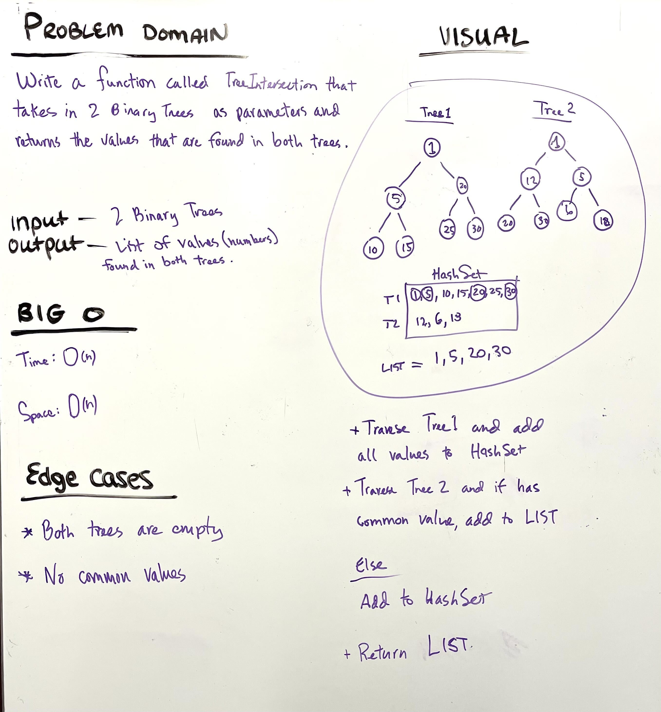

# Hashmap Tree Intersection

* Write a function called TreeInsersection that takes two binary trees as paramaters. Using a hasmap implementation as part of your algorithm, return a set of values found in both trees.

* Arguments: 2 binary trees

* Return: List of values

---

### Problem Domain

Find common values in 2 binary trees

---

### Inputs and Expected Outputs

Input: 2 binary trees

Output: List of values

---

### Big O

| Time | Space |
| :----------- |
| O(n) | O(n) |

---

## Unit Tests

Write tests for the following scenarios, and any other cases that help you ensure your code is working as expected.

---

### Whiteboard Visual

---

### Change Log

---

[Home](/README.md)
