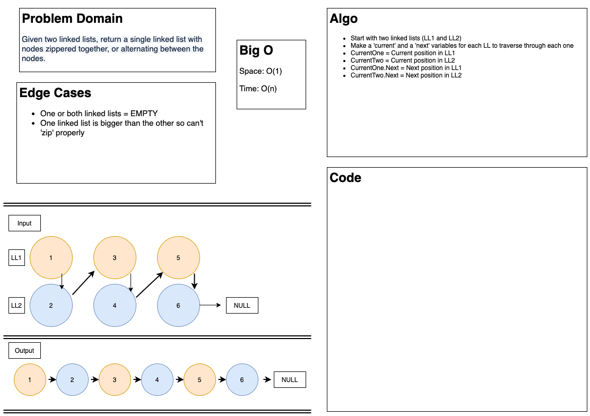

# Linked List - Zipper

## Zip two linked lists

Write the following method for the Linked List class:

* Write a function called zip lists

* Arguments: 2 linked lists

* Return: Linked List, zipped as noted below

* Zip the two linked lists together into one so that the nodes alternate between the two lists and return a reference to the head of the zipped list.

* Try and keep additional space down to O(1)

* You have access to the Node class and all the properties on the Linked List class as well as the methods created in previous challenges.

---

### Problem Domain

* Given two linked lists, return a single linked list with the nodes zippered together, or alternating between nodes

---

### Inputs and Expected Outputs

| Input (**Linked List 1**  & **Linked List 2**) | 
| :----------- | :----------- | :----------- |
| [**head -> [1] -> [3] -> [5] -> X**] |
| [**head -> [2] -> [4] -> [6] -> X**] |

| Expected Output |
| [**head -> [1] -> [2] -> [3] -> [4] -> [5] -> [6] -> X**] |

---

### Big O

| Time | Space |
| :----------- | :----------- |
| O(n) | O(1) |

---

## Unit Tests

Write tests for the following scenarios, and any other cases that help you ensure your code is working as expected.

1. "Happy Path" where the zipper works
2. Linked List 1 is empty
3. Linked List 2 is empty
4. Linked list 1 is bigger than linked list 2
5. Linked list 2 is bigger than linked list 1

---

### Whiteboard Visual

---

### Change Log

---

[Home](/README.md)