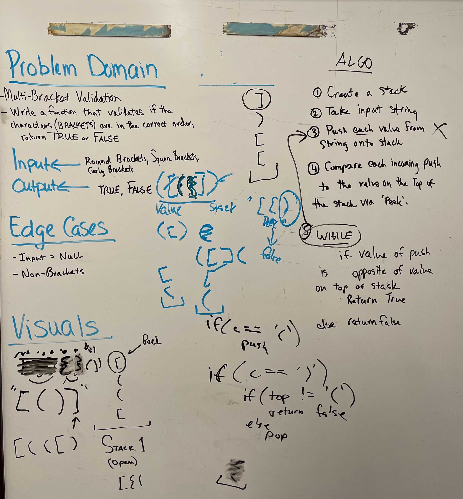

# Stack Queue Brackets

## Brackets

* Write function called ValidateBrackets()

* Arguments: String, Returns: Boolean

  * Representing whether or not the brackets in the string are balanced 

---

### Problem Domain

Write a function that validates if the characters (brackets) are in the correct order, return true or false

---

### Inputs and Ouputs

Input: Round, Square, Squiggly brackets

Output: True or False

---

### Big O

| Time | Space |
| :----------- |
| O(n) | O(n)  |

---

### Unit Tests

Write unit tests to help you ensure your code is working as expected.

---

### Whiteboard Visual

---

[Home](/README.md)