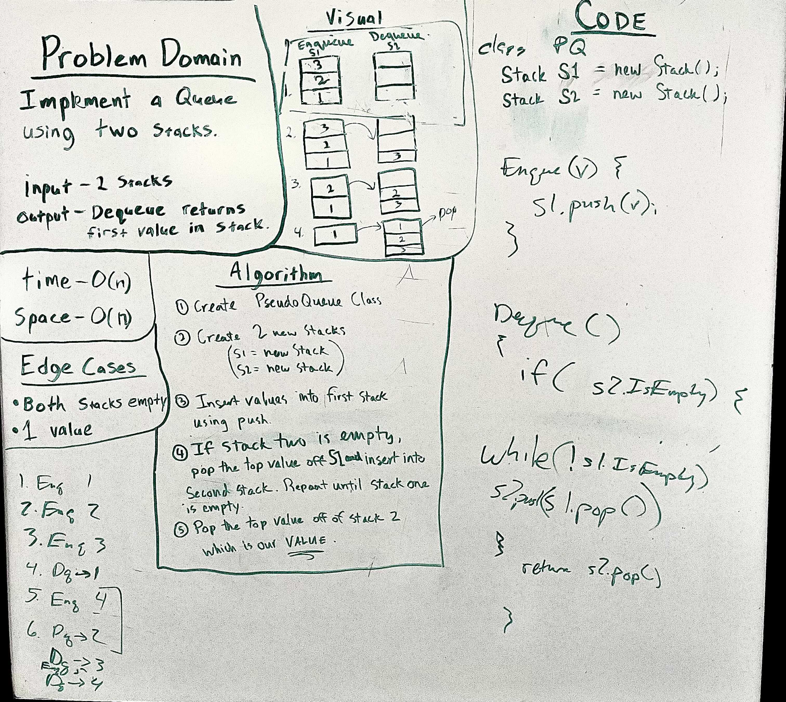

# Stack-Queue

## Pseudo Queue

* Create a new class called "PseudoQueue"

* Implement our standard queue interface

  * enqueue()
  
  * dequque()

---

### Problem Domain

Implement a Queue using two Stacks

---

### Inputs and Expected Outputs

Input: Enqueue VALUES into stacks
[10]->[15]->[20]
Args
[5]

Output: Dequeue retuns first VALUE from the stacks
[5]->[10]->[15]->[20]

---

### Big O

| Time | Space |
| :----------- |
| O(n) | O(n) |

---

## Unit Tests

Write unit tests to help you ensure your code is working as expected.

---

### Whiteboard Visual

---

[Home](/README.md)