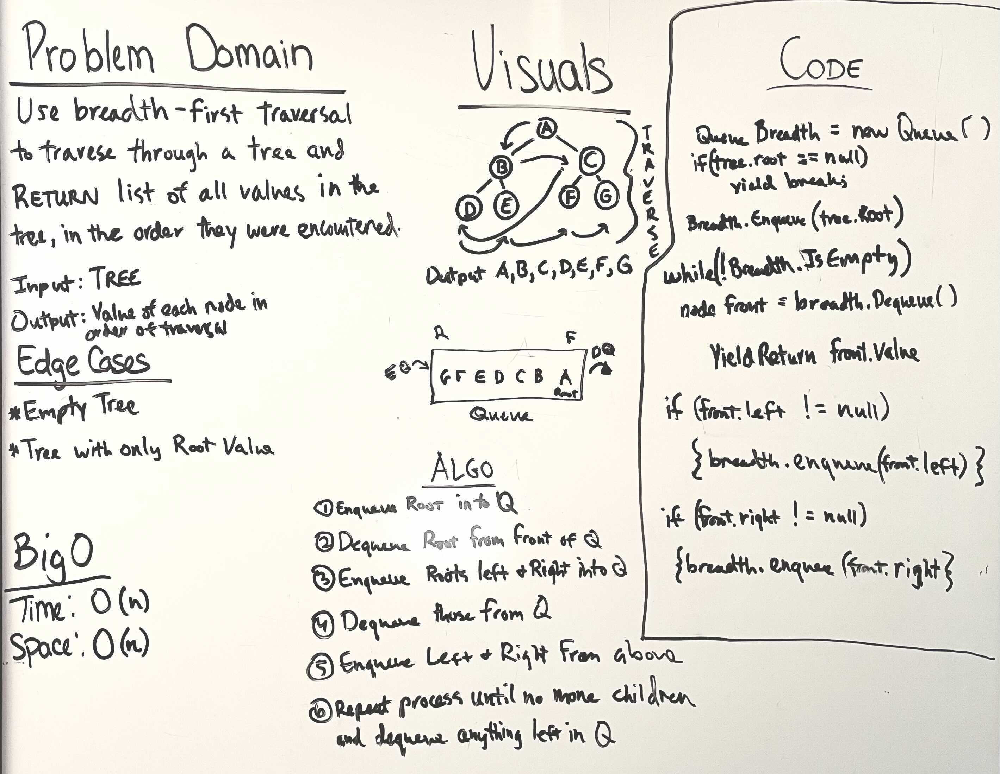

# Tree-Breadth-First

## Breadth First Traversal

* Traverse a tree using a breadth first traversal

---

### Problem Domain

* Use breadth-first traversal to traverse through a tree and return the list of values in the tree, in the order that they were traversed through

---

### Inputs and Expected Outputs

Input: A Binary Tree

Output: The values in the tree in the order they were traversed

---

### Big O

| Time | Space |
| :----------- |
| O(n) | O(n) |

---

## Unit Tests

Write unit tests to help you ensure your code is working as expected.

---

### Whiteboard Visual

---

[Home](/README.md)
