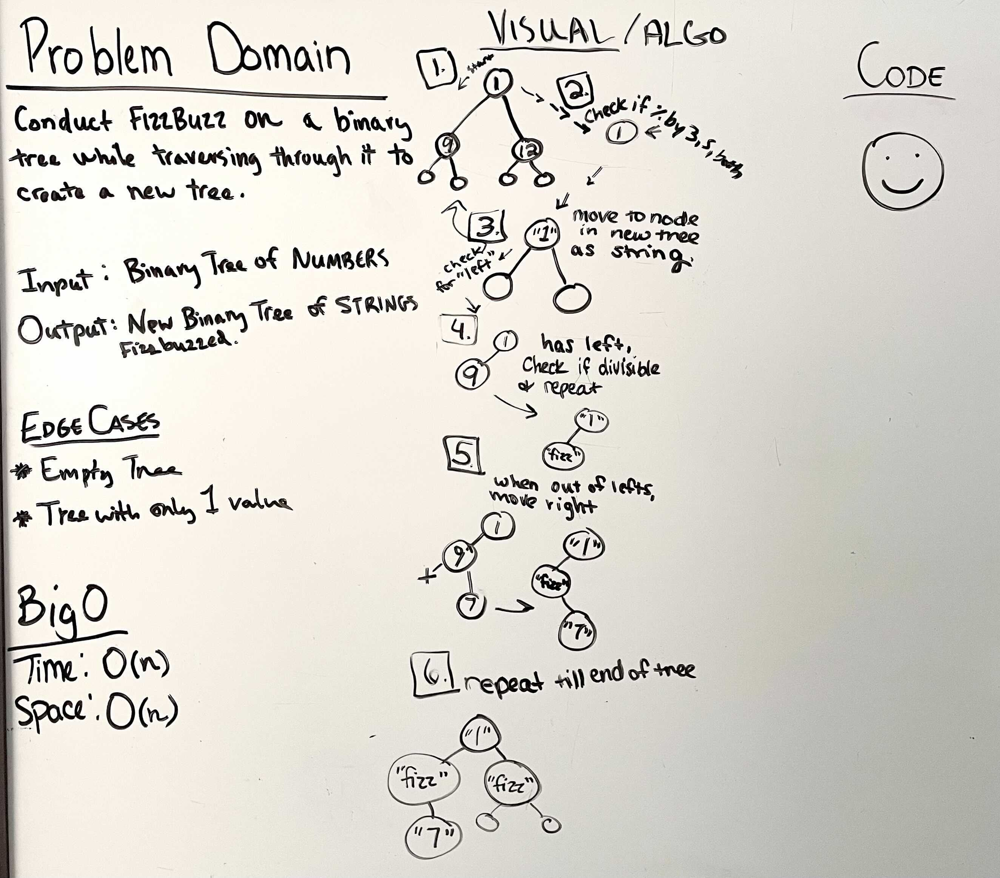

# Tree-Fizz-Buzz

* Fizz Buzz a Binary Tree

---

## Problem Domain

* Conduct FIZZBUZZ on a binary tree while traversing through it. Return a NEW binary tree with string values in the same order as the original tree

---

## Inputs and Expected Outputs

Input: A Binary Tree of numbers

Output: A NEW binary tree of strings, FIZZBUZZED

---

## Big O

| Time | Space |
| :----------- |
| O(n) | O(n) |

---

## Edge Cases

* An empty tree

* A tree with only one value

---

## Unit Tests

Write unit tests to help you ensure your code is working as expected.

---

## Whiteboard Visual

---

[Home](/README.md)