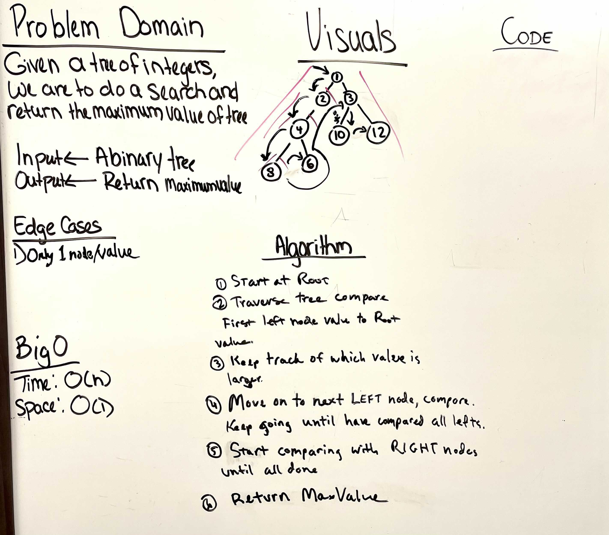

# Tree-Max

## Max value in a Binary Tree

* Create a new class called "Tree Challenges"

* Implement our standard tree interface "BinaryTree"

---

### Problem Domain

Find the MAXIMUM VALUE in a BINARY TREE

---

### Inputs and Expected Outputs

Input: A Binary Tree

Output: The MAX VALUE that is in the tree

---

### Big O

| Time | Space |
| :----------- |
| O(n) | O(n) |

---

## Unit Tests

Write unit tests to help you ensure your code is working as expected.

---

### Whiteboard Visual

---

[Home](/README.md)