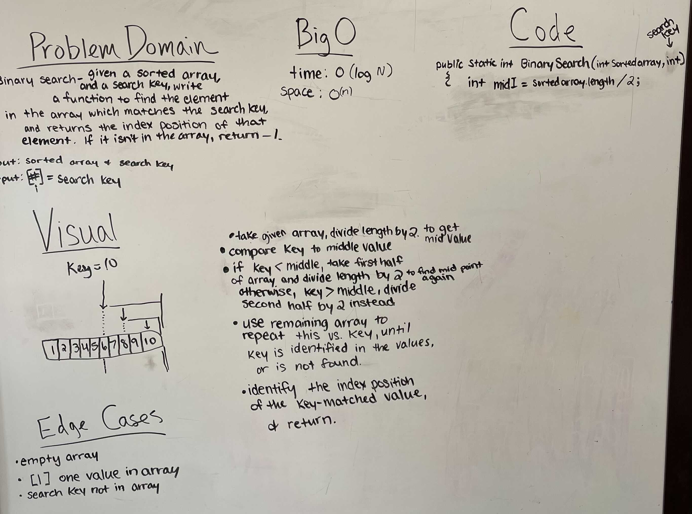

# Array Binary Search

- Given a sorted array, and a search key, write a function to find the element in the array which matches the search key, and then returns the index position of that element. If it isn't in the array, return -1.

## Whiteboard Process

## Approach & Efficiency

- We started with our problem domain of having a sorted array, and a key number. We then tried to find the middle of the array and keep splitting it in half until we found the same index as our key number. We used our visual to help us write the algorithm and then help us with our code. Our Big O was time = O(log n) space = O(n)
