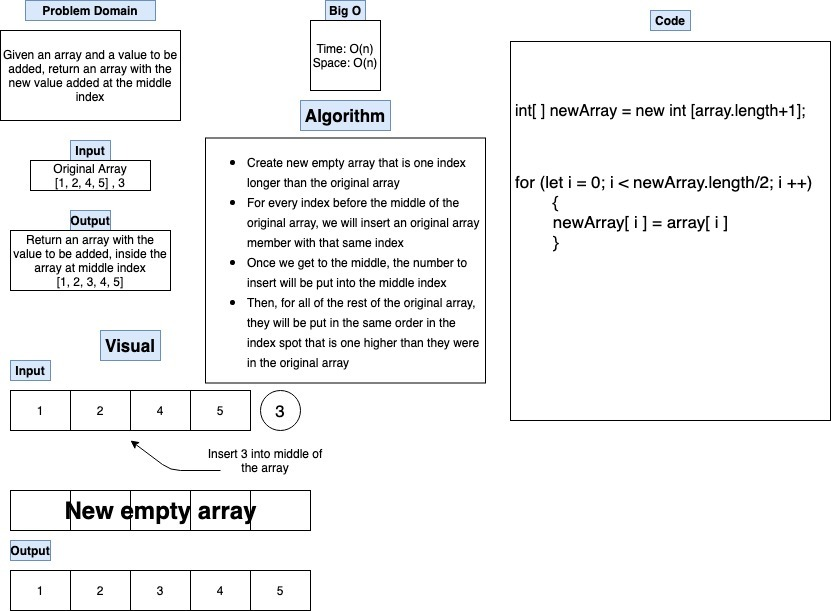

# Insert to Middle of an Array

- Write a function called insertShiftArray which takes in an array and a value to be added. Without utilizing any of the built-in methods available to your language, return an array with the new value added at the middle index.

## Whiteboard Process

## Approach & Efficiency

- We started with our problem domain. Which was to take an existing array, make a new array with one more index value, and insert the number that we are given (that is not in the array), into the middle index of our new array. We used a visual image of what we wanted to do, as well as algorithms to help us write our code. The time and space for Big O on this problem is O(n).
