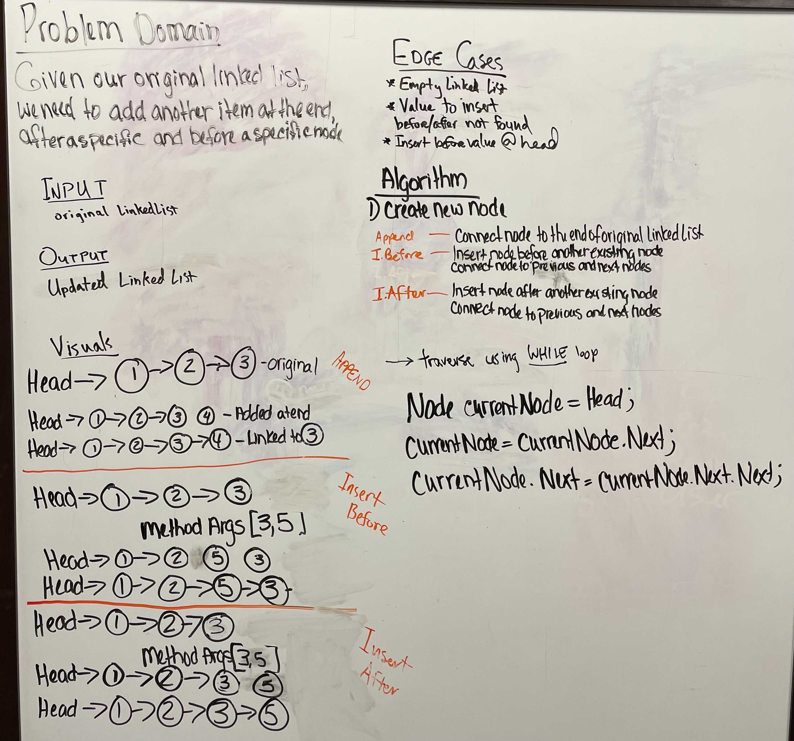

# Linked List Insertions

## Challenge Summary

* Write three new methods using our linked list

  * Append

  * Insert Before

  * Insert After

## Whiteboard Process

## Approach & Efficiency
<!-- What approach did you take? Why? What is the Big O space/time for this approach? -->

## Solution
<!-- Show how to run your code, and examples of it in action -->