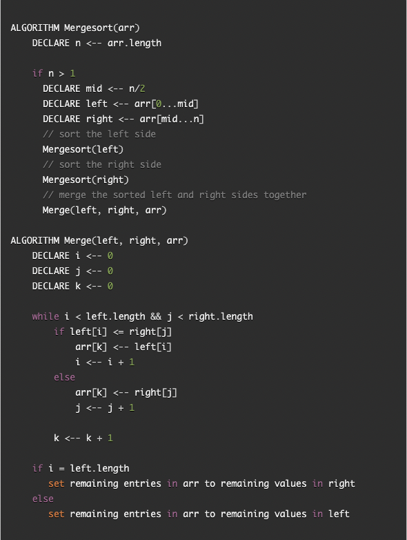
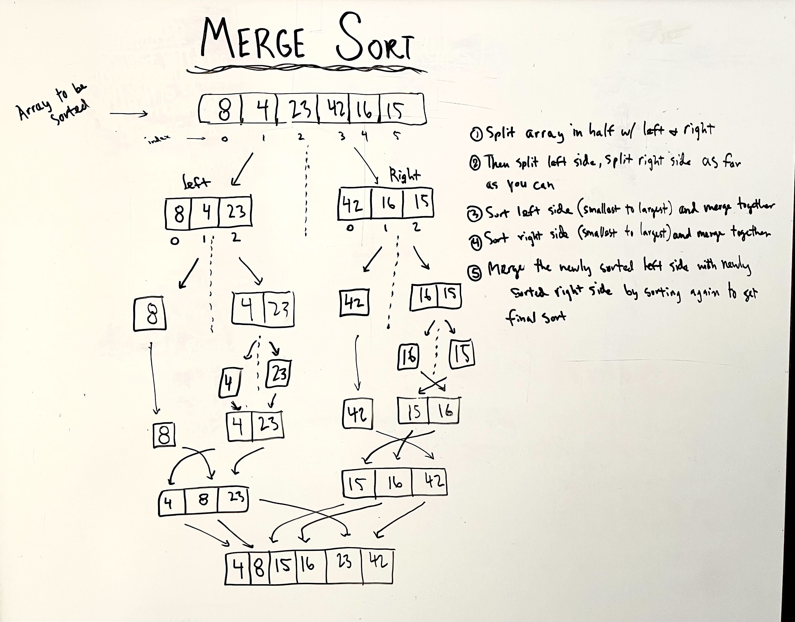

# Sort Merge

## Challenge Summary

* Using the pseudocode below, trace the algorithm by stepping through the process with the provided sample array. Show step-by-step how a Merge Sort works based off of the pseducode. Code a working, and tested implementation of a Merge Sort

* Sample Array

  * ```[8,4,23,42,16,15]```

## Approach & Efficiency

* Pseudo Code



## Solution/Trace

* Walkthrough of different steps in the merge sort



## Efficiency

* Time: O(n^2)

* Space: O(n)
